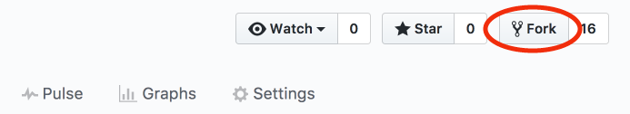
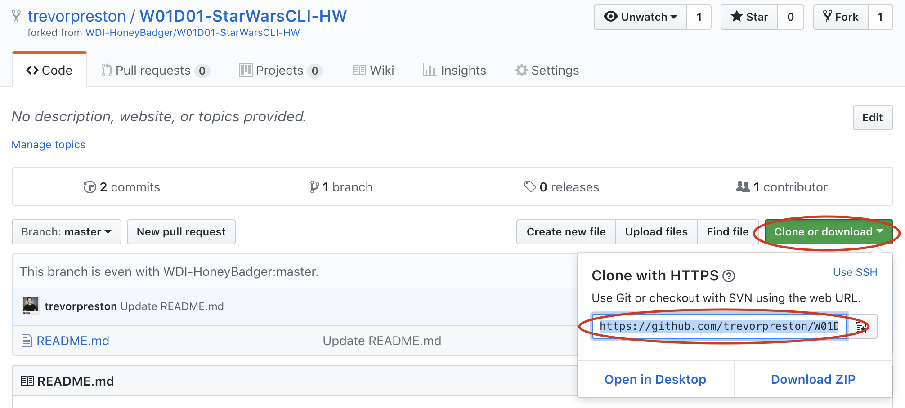
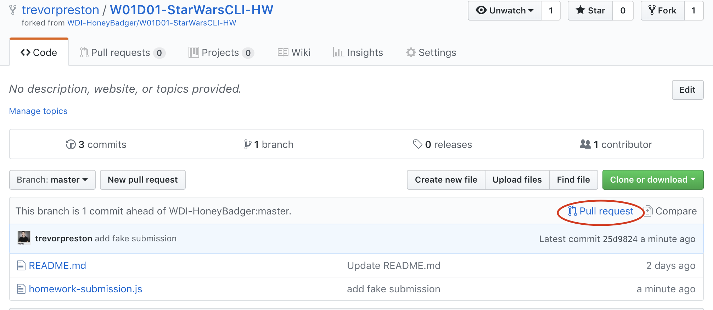
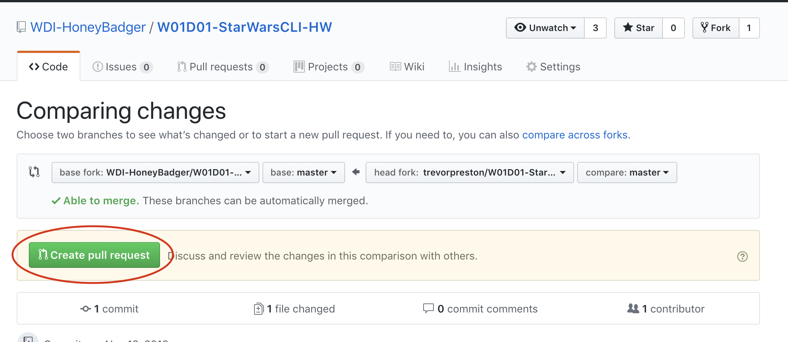
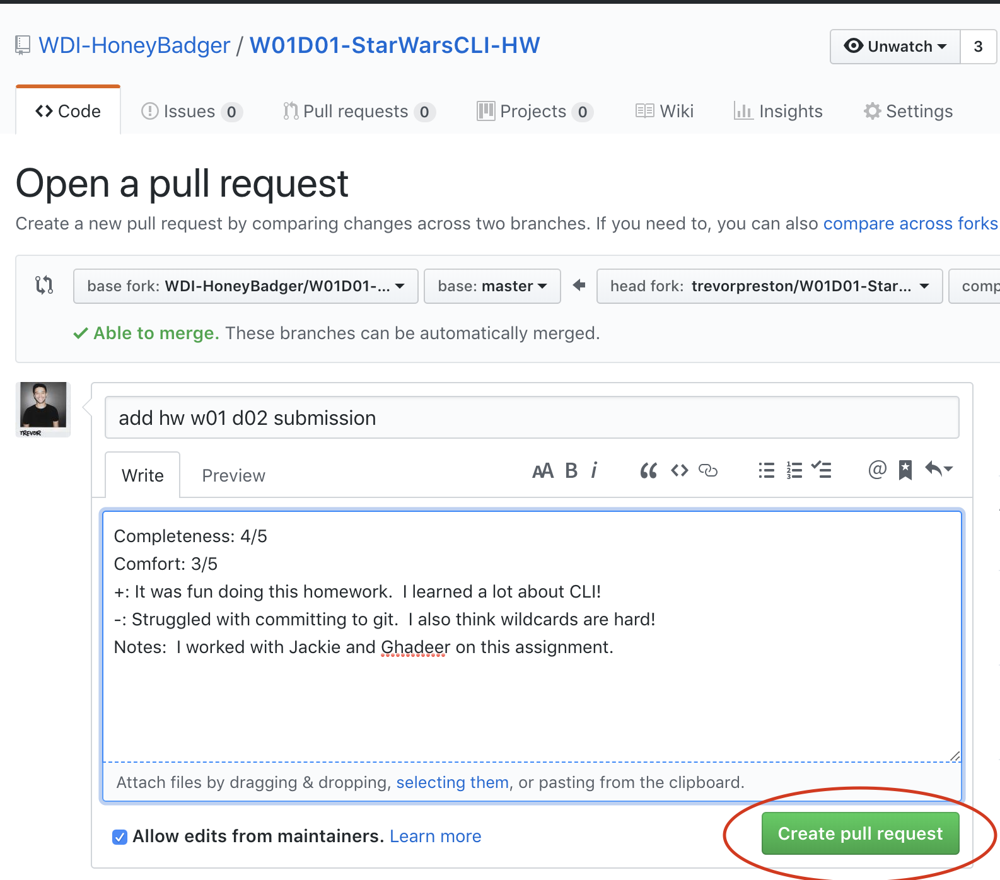

# Homework 1.5 - Starting and submitting hw

### 1. Fork this repository


Go to the forked version attached to your Github and clone to desktop. You'll know you're on the right page if it says "forked from" in the upper left corner under your name. **MAKE SURE YOU ARE WORKING ON YOUR OWN FORK BEFORE ANYTHING**

### 2. Navigate to your homework directory

First open your terminal and navigate to your homework directory using `cd`. If you have the same file structure as we made in class you should be able to open it directly by writing: 

```
cd ~/code/fewd/homework
```

You can also open the folder in finder then drag the file path to your terminal by dragging the folder.


### 3. Clone your forked repository

Copy the link from github.


In terminal, type `git clone ` then paste the link from github. (and press enter)

### 4. Open your code in VS Code

Drag the folder you just cloned to VS Code.


### 5. Do your work. 

In this case, change the `<h1>` content in `index.html` to be your name. **Remember to save!**

### 6. Stage your code

In terminal `cd` into the directory you cloned earlier.

In terminal type `git add .` and press enter.

### 7. Commit your code

In terminal type `git commit -m "your message here"`

**Remember to change the message to describe what you are doing. For instance:** `git commit -m "homework submission"`

### 8. Push your code

In terminal type `git push origin master`

### 9. Open a pull request

In your browser, go to your repo for the homework. You should now see all of your completed homework there. Once you confirmed you're homework is online, you can start a pull request. Click here:



Then here:



### 10. Fill out your submission. 

When submitting, include the following:
- on a scale from 1 to 5, how complete is this homework?
- on a scale from 1 to 5, how comfortable were you with this assignment?
- what was a win you had with this assignment?
- what was a challenge you had with this assignment?
- other stuff on your mind? work with anyone? tell us about it! 


### 11. Hit submit!

